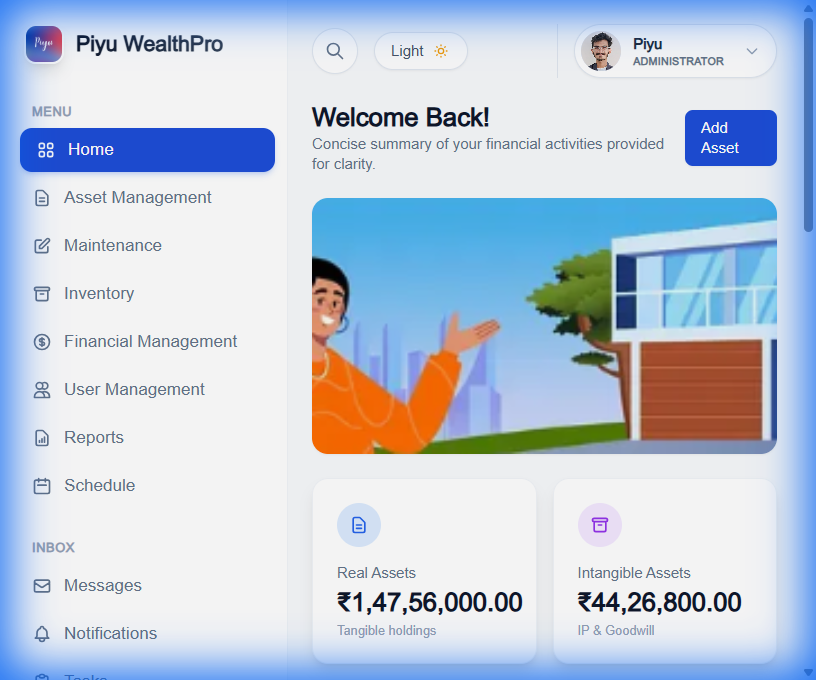
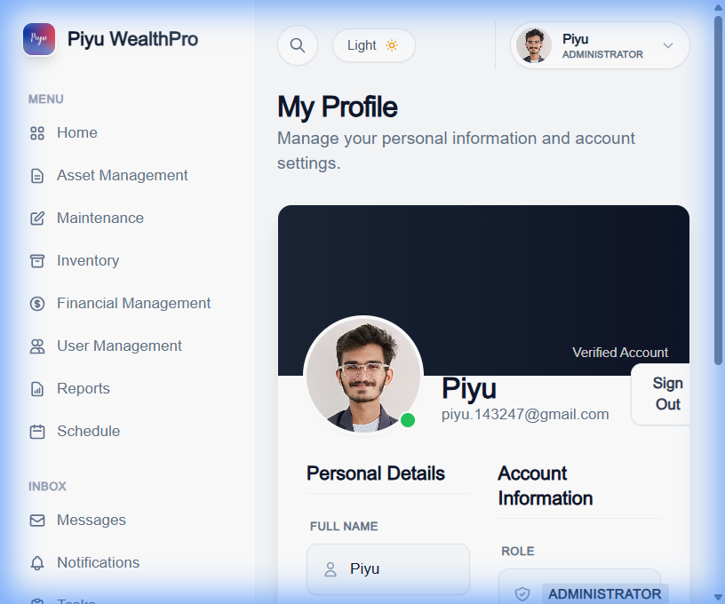

# Piyu WealthPro

A comprehensive asset management dashboard to track your financial, tangible, and intangible assets.

## Features

- **Dashboard**: Real-time overview of your asset portfolio, value distribution, and recent activity.
- **Asset Management**: Add, update, and categorize assets (Financial, Real Estate, etc.).
- **Inventory Tracking**: Manage physical inventory with stock alerts.
- **Maintenance Logs**: Track maintenance schedules and costs for your assets.
- **Financial Records**: Record income and expenses to keep your ledger up to date.
- **Schedule**: Calendar view for upcoming events and tasks.
- **User Management**: Invite and manage users with role-based access.

## Screenshots

### Dashboard
Overview of your portfolio health.

### Asset Management
List and manage all your assets in one place.

### Professional Profile
Manage your personal information and settings.

## Support

If you need any assistance, please contact us at **piyu.143247@gmail.com**.
